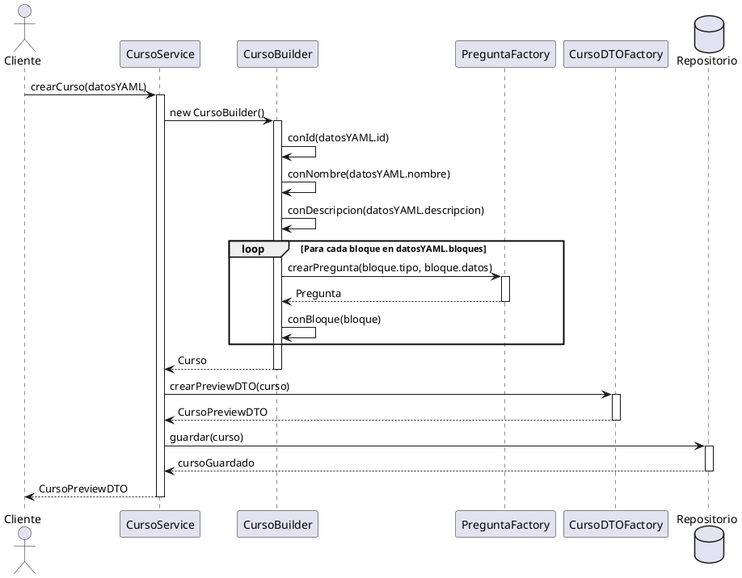
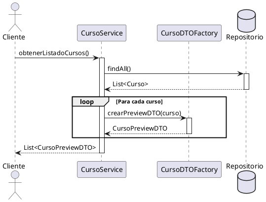

# Patrones de Diseño en el Sistema de Cursos

## Análisis de Patrones para la Construcción de Cursos

### Patrón Abstract Factory + Builder

Se propone una combinación de Abstract Factory y Builder para la construcción de cursos, considerando:
- Diferentes tipos de preguntas (test, completar huecos, flashcards)
- Implementaciones específicas para cada tipo
- Carga dinámica de módulos (microkernel)
- Consistencia en la creación de objetos relacionados

#### Estructura Base
```java
// Abstract Factory para crear preguntas
public interface PreguntaFactory {
    Pregunta crearPregunta(String tipo, Map<String, Object> datos);
}

// Implementaciones específicas
public class TestPreguntaFactory implements PreguntaFactory {
    @Override
    public Pregunta crearPregunta(String tipo, Map<String, Object> datos) {
        // Crear pregunta tipo test
    }
}

public class CompletarHuecosFactory implements PreguntaFactory {
    @Override
    public Pregunta crearPregunta(String tipo, Map<String, Object> datos) {
        // Crear pregunta tipo completar huecos
    }
}

// Builder para construir el curso completo
public class CursoBuilder {
    private Curso curso;
    
    public CursoBuilder conId(String id) {
        curso.setId(id);
        return this;
    }
    
    public CursoBuilder conBloque(Bloque bloque) {
        curso.agregarBloque(bloque);
        return this;
    }
    
    public Curso construir() {
        return curso;
    }
}
```

### Integración de CursoPreviewDTO

La clase `CursoPreviewDTO` se integra en el diseño como parte del patrón DTO (Data Transfer Object):

#### Estructura de DTOs
```java
// Factory para DTOs
public interface CursoDTOFactory {
    CursoPreviewDTO crearPreviewDTO(Curso curso);
    CursoCompletoDTO crearCompletoDTO(Curso curso);
}

// Implementación específica
public class CursoDTOFactoryImpl implements CursoDTOFactory {
    @Override
    public CursoPreviewDTO crearPreviewDTO(Curso curso) {
        return new CursoPreviewDTO(
            curso.getId(),
            curso.getNombre(),
            curso.getDescripcion(),
            curso.getNivel()
        );
    }
}

// Builder específico para DTOs
public class CursoPreviewDTOBuilder {
    private CursoPreviewDTO dto = new CursoPreviewDTO();
    
    public CursoPreviewDTOBuilder conId(String id) {
        dto.setId(id);
        return this;
    }
    
    public CursoPreviewDTOBuilder conNombre(String nombre) {
        dto.setNombre(nombre);
        return this;
    }
    
    public CursoPreviewDTOBuilder conDescripcion(String descripcion) {
        dto.setDescripcion(descripcion);
        return this;
    }
    
    public CursoPreviewDTOBuilder conNivel(String nivel) {
        dto.setNivel(nivel);
        return this;
    }
    
    public CursoPreviewDTO construir() {
        return dto;
    }
}
```

#### Ejemplo de Uso
```java
// Ejemplo de uso en un servicio
public class CursoService {
    private final CursoDTOFactory dtoFactory;
    
    public List<CursoPreviewDTO> obtenerListadoCursos() {
        List<Curso> cursos = cursoRepository.findAll();
        return cursos.stream()
            .map(dtoFactory::crearPreviewDTO)
            .collect(Collectors.toList());
    }
    
    // O usando el builder
    public CursoPreviewDTO crearPreviewDesdeYAML(Map<String, Object> yamlData) {
        return new CursoPreviewDTOBuilder()
            .conId((String) yamlData.get("id"))
            .conNombre((String) yamlData.get("nombre"))
            .conDescripcion((String) yamlData.get("descripcion"))
            .conNivel((String) yamlData.get("nivel"))
            .construir();
    }
}
```

## Ventajas del Diseño

1. **Separación de Responsabilidades**
   - `CursoPreviewDTO` maneja la presentación
   - Las factories manejan la creación
   - Los builders manejan la construcción

2. **Flexibilidad**
   - Fácil de extender para nuevos tipos de DTOs
   - Permite diferentes representaciones del mismo curso

3. **Mantenibilidad**
   - Código limpio y organizado
   - Fácil de modificar sin afectar otras partes

4. **Integración con Microkernel**
   - Los DTOs son parte de la capa de presentación
   - Las factories pueden ser cargadas dinámicamente
   - Permite diferentes implementaciones de DTOs según necesidades

## Consideraciones Finales

La estructura propuesta permite:
- Mantener una clara separación entre el modelo de dominio y la capa de presentación
- Facilitar la transformación de datos entre capas
- Reducir la cantidad de datos transferidos cuando solo se necesita información básica
- Mantener la consistencia en la creación de DTOs
- Facilitar la extensión y mantenimiento del código

La clase `CursoPreviewDTO` actúa como un puente entre el modelo de dominio complejo y las necesidades de presentación más simples, siguiendo el principio de responsabilidad única y facilitando la mantenibilidad del código.

## Secuencias de Uso

### Creación de un Curso



Este diagrama muestra:
1. El cliente solicita la creación de un curso
2. El servicio utiliza el Builder para construir el curso
3. Para cada bloque, se usa la Factory para crear las preguntas
4. Se crea un DTO para la respuesta
5. El curso se guarda en el repositorio

### Obtención de Listado de Cursos



Este diagrama muestra:
1. El cliente solicita el listado de cursos
2. El servicio obtiene los cursos del repositorio
3. Para cada curso, se crea un DTO usando la factory
4. Se devuelve la lista de DTOs al cliente 

## Patrón Singleton

El patrón Singleton se utiliza en dos casos específicos en el proyecto:

### ModuleManager

```java
public class ModuleManager {
    private static ModuleManager instance;
    private final List<QuestionModule> modules;
    
    private ModuleManager() {
        this.modules = new ArrayList<>();
        cargarModulos();
    }
    
    public static ModuleManager getInstance() {
        if (instance == null) {
            instance = new ModuleManager();
        }
        return instance;
    }
}
```

**Justificación:**
1. **Gestión Centralizada de Módulos**: 
   - Necesitamos un único punto de acceso para gestionar los módulos cargados
   - Evita la duplicación de carga de módulos y posibles conflictos
   - Mantiene un estado consistente de los módulos disponibles

2. **Recursos Compartidos**:
   - Los módulos son recursos compartidos por toda la aplicación
   - El Singleton garantiza que todos los componentes accedan a la misma instancia de módulos
   - Evita la duplicación de memoria y recursos

3. **Carga Lazy**:
   - Los módulos se cargan solo cuando se necesita por primera vez
   - Mejora el rendimiento inicial de la aplicación
   - Permite una inicialización controlada de los recursos

### CursoManager

```java
public class CursoManager {
    private static CursoManager instance;
    private final CursoPreviewService cursoPreviewService;
    
    private CursoManager() {
        this.cursoPreviewService = new CursoPreviewService("cursos");
    }
    
    public static CursoManager getInstance() {
        if (instance == null) {
            instance = new CursoManager();
        }
        return instance;
    }
}
```

**Justificación:**
1. **Gestión de Estado Global**:
   - Mantiene un estado consistente de los cursos cargados
   - Evita la duplicación de carga de cursos
   - Proporciona un punto único de acceso a los cursos

2. **Caché Implícito**:
   - Al ser singleton, actúa como caché de los cursos cargados
   - Mejora el rendimiento al evitar cargas repetidas
   - Mantiene la consistencia de los datos

3. **Coordinación de Recursos**:
   - Coordina el acceso a los recursos de cursos
   - Evita conflictos de acceso concurrente
   - Centraliza la lógica de gestión de cursos

### Consideraciones de Implementación

1. **Thread Safety**:
   - La implementación actual no es thread-safe
   - En una aplicación multihilo, se debería considerar usar:
     - Double-checked locking
     - Enum singleton
     - O sincronización explícita

2. **Testing**:
   - El patrón Singleton puede complicar las pruebas unitarias
   - Se recomienda:
     - Usar inyección de dependencias donde sea posible
     - Proporcionar métodos de reset para testing
     - Considerar el uso de mocks en pruebas

3. **Flexibilidad**:
   - Aunque usamos Singleton, mantenemos la flexibilidad mediante:
     - Interfaces bien definidas
     - Separación clara de responsabilidades
     - Posibilidad de extender la funcionalidad

### Integración con Otros Patrones

El Singleton se integra bien con los otros patrones utilizados:

1. **Con Abstract Factory**:
   - Los managers singleton pueden actuar como factories
   - Proporcionan un punto único de creación de objetos
   - Mantienen la consistencia en la creación

2. **Con Builder**:
   - Los managers pueden coordinar el proceso de construcción
   - Mantienen el estado durante la construcción
   - Proporcionan una interfaz única para el proceso

3. **Con Microkernel**:
   - Los managers singleton actúan como puntos de registro
   - Mantienen el estado de los módulos cargados
   - Proporcionan una interfaz única para el sistema de plugins 

## Sistema de Logging

El sistema de logging utiliza el patrón Singleton para garantizar una única instancia del logger en toda la aplicación:

```java
public class Logger {
    private static Logger instance;
    private final PrintWriter logWriter;
    
    private Logger() {
        try {
            this.logWriter = new PrintWriter(new FileWriter("kursor.log", true));
        } catch (IOException e) {
            throw new RuntimeException("Error al inicializar el logger", e);
        }
    }
    
    public static Logger getInstance() {
        if (instance == null) {
            instance = new Logger();
        }
        return instance;
    }
}
```

### Justificación del Singleton

1. **Gestión Centralizada**:
   - Un único punto de escritura para logs
   - Evita conflictos de escritura
   - Formato consistente en mensajes

2. **Control de Recursos**:
   - Un único stream de escritura
   - Evita duplicación de handles
   - Cierre controlado del archivo

3. **Configuración Global**:
   - Configuración única del sistema
   - Cambios centralizados
   - Consistencia en la aplicación

### Consideraciones de Implementación

1. **Thread Safety**:
   - Implementación actual no thread-safe
   - Opciones de mejora:
     - Double-checked locking
     - Enum singleton
     - Sincronización explícita

2. **Testing**:
   - Desafíos en pruebas unitarias
   - Soluciones:
     - Inyección de dependencias
     - Métodos de reset
     - Uso de mocks

3. **Flexibilidad**:
   - Interfaces bien definidas
   - Separación de responsabilidades
   - Extensibilidad

4. **Integración**:
   - Compatible con Abstract Factory
   - Funciona con Builder
   - Se integra con Microkernel
